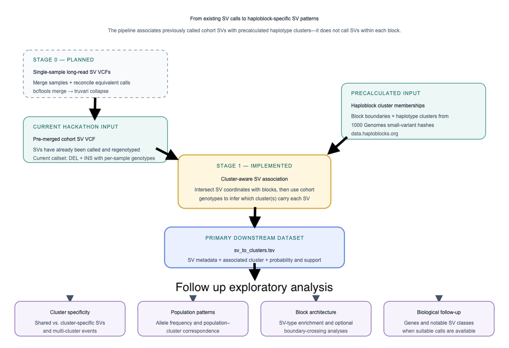
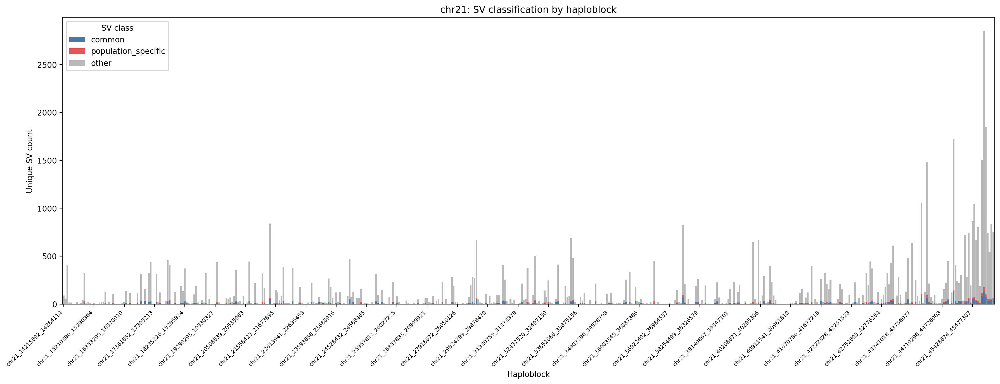
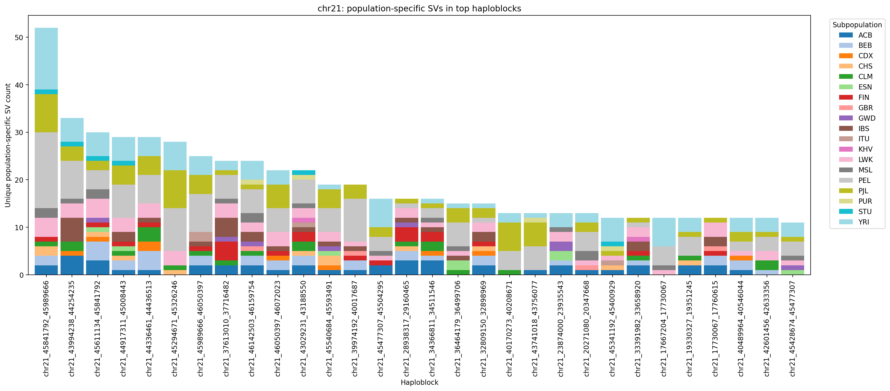

> Structural Variants Hackathon at Baylor College of Medicine, August 25-28, 2026

# 
<h1 align="center">Haploblock SV</h1>

<p align="center">
  
 
  <h3 align="center">A pipeline for implicit analysis of structural variants within haploblocks.</h3>
</p>


# Quickstart
Install dependencies:
```bash
pip install -r claude-first-prototype/requirements.txt
```

Run the pipeline:
```bash
python claude-first-prototype/pipeline/stage1_cluster_aware.py
```

The current workflow starts from a previously merged VCF and writes chromosome-specific SV-to-cluster association tables into `stage1_output/`.
See [claude-first-prototype/README.md](claude-first-prototype/README.md) for output fields, interpretation, QC, and the optional boundary-position analysis.
Stage 0 is currently a placeholder to download single-sample VCFs from 1kgp and merge them into a cohort VCF.

# Overview

We aim to reveal how structural variation is organized within and around haploblocks, and what that may tell us about haplotype and population structure.

This project follows [haploblocks.org](https://haploblocks.org) and [data.haploblocks.org](https://data.haploblocks.org), which determined haploblock boundaries and clustered haplotypes within each block using 1000 Genomes small variants. Those results did not incorporate structural variants, so they cannot directly identify which existing haplotype clusters carry a particular SV.

So far implemented: cluster-aware preprocessing that combines cohort SV genotypes with those existing cluster memberships and probabilistically assigns SVs to one or more clusters. This is necessary because the VCF and haploblock clusters were phased independently, so their `hap0` and `hap1` labels cannot be matched directly.

The wider pipeline is exploratory rather than a fixed production analysis. It is intended to test biological expectations about SVs and haploblocks—for example, whether SVs consistently mark particular haplotype clusters, whether some blocks or clusters contain unusual SV patterns, and whether those patterns reflect population structure. The downstream analyses will evolve as these assumptions are evaluated.

- Infer which haplotype clusters within each haploblock carry each SV (currently DEL and INS)
- Separately, if useful, check whether SVs fall near or across haploblock boundaries
- Assess Haploblock enrichment for specific SV types by testing whether certain haploblocks contain significantly higher or lower number of particular SV classes.
- Classify structural variants (SVs) as common or population-specific based on population frequency data
- Check if these SVs correlate with 1000 Genomes population clusters
- Wrap it up in a re-usable and scalable pipeline


## Contributors

The scientific idea, aim and scope of this project were introduced by:

- Jędrzej Kubica jedrzej.kubica@univ-grenoble-alpes.fr 
- Lynn Ly lynn.ly@nanoporetech.com
- Maria Fernanda Cardenas maria.cardenas@stjude.org
- Linh Nguyen nguyen.linh.1010@ku.edu

The technology was created by agentic AI provided by Claude, ChatGPT and Codex.

# Workflow



## Data

- genomic hashes and clusters: [data.haploblocks.org](https://data.haploblocks.org)
- 1000 Genomes HGSVC: [https://www.internationalgenome.org/human-genome-structural-variation-consortium/](https://www.internationalgenome.org/human-genome-structural-variation-consortium)
- Long read 1KGP SV calls: [https://s3.amazonaws.com/1000g-ont/index.html?prefix=PROCESSED_DATA/ALIGNED_TO_HG38/SNIFFLES_v2.6.2/](https://s3.amazonaws.com/1000g-ont/index.html?prefix=PROCESSED_DATA/ALIGNED_TO_HG38/SNIFFLES_v2.6.2/)
- 1KGP haplotype-resolved SVs [https://www.nature.com/articles/s41467-018-08148-z](https://www.nature.com/articles/s41467-018-08148-z): Study ID nstd152 (Chaisson et al. 2019)

## Pipeline Overview 

| Stage | Name | Purpose |
|---|---|---|
| Stage 0 | Data ingestion and harmonization | Download and reconcile VCF files |
| Stage 1 | Data preparation | Prepare and standardize input variant and haplotype data |
| Stage 2 | SV annotation | Annotate SVs relative to haploblocks |
| Stage 3 | Boundary enrichment | Removed |
| Stage 4 | Haploblock classification | Define common vs population-specific haploblocks |
| Stage 5 | SV type enrichment | Test enrichment of SV types across haploblock classes |
| Stage 6 | Population-conditioned cluster association | Test whether local SNV-derived clusters predict SV carriage beyond population membership |
| Stage 7 | Haploblock information gain and QC | Measure what local hashes capture or miss about SV carriage; retain SV PCA as QC |
| Stage 8 | Consequence-aware annotation | Rank cluster-informative SVs using SV-type-aware gene, exon, and breakpoint consequences |


## Development status 

The pipeline is currently under active development 

- [x] Repository setup
- [x] Define pipeline architecture
- [x] Stage 0 — Data ingestion and harmonization
- [x] Stage 1 — Data preparation
- [x] Stage 2 — SV annotation
- [ ] Stage 3 — Boundary enrichment
- [x] Stage 4 — Common vs population-specific SV classification
- [x] Stage 5 — SV type enrichment
- [x] Stage 6 — Population-conditioned SV–cluster association
- [x] Stage 7 — Haploblock information gain and population-structure QC
- [x] Stage 8 — Consequence-aware candidate annotation


# Results
The current prototype uses 1kgp_ont_cohort.postfilter.full.vcf.gz , a previously merged structural variant callset derived from the 1000 Genome Project Oxford Nanopore Technologies (ONT) cohort, comprising a total of 402 samples. For this initial demonstration, we focused on chromosome 21 to confirm successful integration of the pipeline, and assess the overall analytical framework. 

The purpose of Stage 2 purpose is to classify SVs based on their positional relationship to haploblock regions. For this demonstration, the input VCF contained 83,159 unique SV records, which were categorized into three classes

| Position class | Count | Definition |
|---|---|---|
|within block|60,367|The SV overlaps exactly one haploblock.|
|outside block|22,760|The SV overlaps exactly no haploblock.|
|boundary crossing|22|The SV overlaps two or more haploblocks.|

These results provide a quantification on how SVs are distributed relative to haploblock regions. In addition to their positional classification, 17,222 SVs were classified as near boundary, indication that they occur close to a haploblock boundary, whereas 65,927 Svs were classified as not near boundary. 

The purpose of Stage 4 is to classify each structural variant (SV) according to its allele frequency (AF) distribution across population subgroups within the cohort and to associate these classifications with haploblocks. This analysis enables the identification of population haploblocks with enriched population-specific SVs but it does not test association with the SNV-derived clusters. 


Figure 1-stage4: The figure illustrates the distribution of structural variant (SV) composition across haploblocks on chromosome 21, based on allele frequencies observed in the study cohort. 


Figure 2-stage4: Top 30 haplablocks ranked by the number of unique structural variants (SVs) observed exclusively within each subpopulation. Each unique SV is counted once per subpopulation, provided that at least two samples carry the SV.

Stage 5 (In Progress)

Stage 6 (In Progress still reviewing and verifying data)


# Future steps

- Add informative plots to all the stages
- Verify all stages results and modify them as need it.  


# References
https://osf.io/preprints/biohackrxiv/xhkc3_v1
